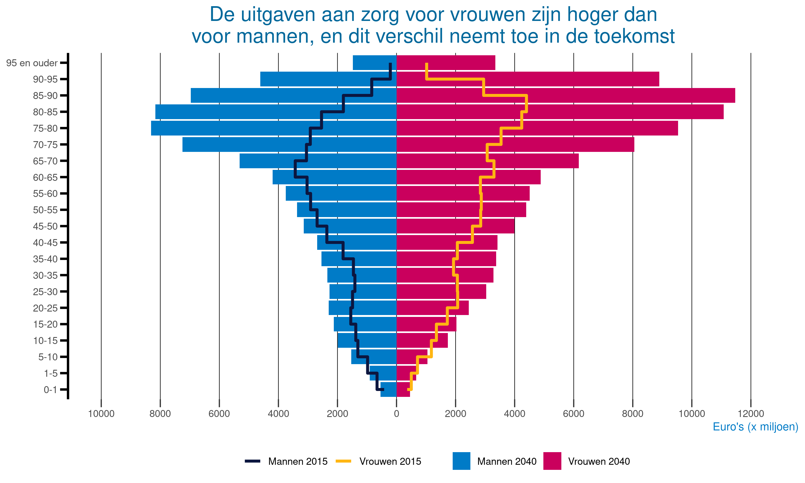

# Reproducing a colourful visualization with ggplot

On [https://www.vtv2018.nl/zorguitgaven](https://www.vtv2018.nl/zorguitgaven) a very nice visualization was publiced on zorguitgaven (healthcare expenses):


Using the data provided online, I reproduced this visualization with ggplot.  

#### Script
``` r
# Load package
library(tidyverse)


# Read data
df <- read_csv("zorguitgaven.csv")
rbind(head(df, 3), tail(df, 3))


# Transform and show data
df = gather(read_csv('zorguitgaven.csv'), Type, Value, 2:5)
df$Type <- as.factor(df$Type)
df$Category <- factor(df$Category, levels = c("0-1", "1-5", "5-10", "10-15", "15-20",
                                              "20-25", "25-30", "30-35", "35-40", "40-45",
                                              "45-50", "50-55", "55-60", "60-65", "65-70",
                                              "70-75", "75-80", "80-85", "85-90", "90-95",
                                              "95 en ouder"))
rbind(head(df, 3), tail(df, 3))


# Visualize data
ggplot(df, aes(Category, Value)) + 
  geom_bar(data= df %>% filter(Type %in% c('Mannen 2040', 'Vrouwen 2040')),
           aes(fill = Type),
           linetype = 0,
           stat = "identity") +
  scale_fill_manual(values = c("#007BC7", "#CA005D")) +
  geom_step(data = df %>% filter(Type %in% c('Mannen 2015', 'Vrouwen 2015')),
            aes(group = Type, color = Type),
            size = 1.25,
            direction = "vh",
            linetype = 1) +
  scale_color_manual(values = c("#0C163F", "#FFB612")) +
  scale_y_continuous(name = "Euro's (x miljoen)",
                     lim = c(-10000, 12500),
                     breaks = seq(-10000, 12500, 2000),
                     labels = abs(seq(-10000, 12500, 2000))) +
  theme(panel.background = element_blank(),
        panel.grid.major.x = element_line(colour = "black", size = 0.25),
        panel.grid.major.y = element_blank(),
        panel.grid.minor = element_blank(),
        axis.title.x = element_text(colour = "#007BC7", size = 10, hjust = 1),
        axis.title.y = element_blank(),
        plot.title = element_text(color = "#01689B", size= 18, hjust = 0.5),
        legend.position = "bottom",
        legend.title = element_blank(),
        legend.key = element_blank(),
        axis.ticks.length=unit(.25, "cm"),
        axis.line.y = element_line(size = 1, linetype = "solid"),
        axis.ticks.y = element_line(colour = "black", size = 1)) +
  ggtitle("De uitgaven aan zorg voor vrouwen zijn hoger dan voor mannen, en dit verschil\n
          neemt toe in de toekomst\n") +
  coord_flip()


# Save plot
ggsave("zorguitgaven.png", width=10, height=6)
```
#### Result

